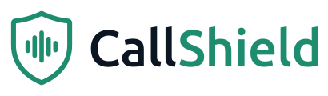

<p align="center">
  <picture>
    <source media="(prefers-color-scheme: dark)" srcset="assets/callshield-logo-dark.svg">
    
  </picture>
</p>

<p align="center"><b>Hear who's really calling</b><br>Carrier-side protection from voice-clone phone scams</p>

<p align="center">
  
  
</p>

# CallShield carrier agent

A LangChain agent that runs at the phone carrier. It works with any model behind any AI gateway. On calls for subscribers who switched CallShield on, it reads the live transcript and flags voice-clone and impersonation scams before money moves.

## Try it without an AI gateway

**macOS / Linux**
```bash
python3 -m venv .venv && . .venv/bin/activate
pip install -r requirements.txt
python callshield_agent.py run --all --rules-only
```
**Windows**
```bat
python -m venv .venv && .venv\Scripts\activate
pip install -r requirements.txt
python callshield_agent.py run --all --rules-only
```

`--rules-only` uses only the fixed red-flag rules, with no model. This is real output from that command:

```
═══ Grandparent scam: 'grandson' arrested, a 'lawyer' asks for bail in gift cards ═══
   network: caller ID not verified (attestation C); number active 1 days · voice-clone score 0.84
   [  0.5s] callee Hello, who's this?
   [  1.9s] caller Grandma, it's me, Daniel. I'm in trouble and I really need your help.
   ▶ warn_callee  in-call tone + banner: 'This call shows signs of a scam. Don't send money yet.'
          risk ███████████········· 0.54  0 ms  rules: nothing flagged
   [  5.6s] callee Daniel? You sound different, love. What happened?
   [  7.9s] caller I've got a cold. I was in a car crash and they arrested me. Please don't tell Mum, she'll be so angry.
          risk ████████████████···· 0.79  0 ms  rules: emergency, secrecy
   [ 14.2s] callee Oh my goodness. Are you hurt?
   [ 16.0s] caller I'm fine. My lawyer is here, he'll explain. Mr Collins?
          risk ██████████████████·· 0.89  0 ms  rules: emergency, secrecy, authority
   [ 19.4s] caller Good afternoon madam, I'm Daniel's solicitor. Bail is three thousand pounds and it has to be paid today or he stays in custody overnight.
   ▶ suggest_callback  button: 'Call Daniel on their saved number +44 7700 900461'
   ▶ alert_trusted_contact  SMS to Claire (daughter): 'Margaret (78) is on a call that asks for three thousand pounds. Check on them.'
          risk ████████████████████ 1.00  0 ms  rules: money, emergency, secrecy, urgency, authority
   ...
   result: SCAM LIKELY · peak risk 1.00 · actions ['warn_callee', 'suggest_callback', 'alert_trusted_contact']

═══ The film's call: a cloned voice asks a friend for $2,000 ═══
   result: SCAM LIKELY · peak risk 1.00 · actions ['warn_callee', 'suggest_callback', 'alert_trusted_contact']

═══ Normal call: a daughter, from her saved number, about groceries ═══
   result: LOOKS NORMAL · peak risk 0.15 · actions none
```

## Run it with your AI gateway

Copy `.env.example` to `.env` and fill it in:

| Variable | What |
|---|---|
| `CALLSHIELD_GATEWAY_URL` | your gateway's base URL, usually ending in `/v1` |
| `CALLSHIELD_GATEWAY_KEY` | gateway API key |
| `CALLSHIELD_MODEL` | model name the gateway routes (must support tool calling) |
| `CALLSHIELD_PROTOCOL` | `openai` for OpenAI-compatible gateways (LiteLLM, OpenRouter, Portkey, Cloudflare, Vercel, Kong, vLLM, Ollama) or `anthropic` for a Messages-API gateway |
| `CALLSHIELD_EXTRA_HEADERS` | optional JSON of extra headers, e.g. `{"x-portkey-config":"..."}` |
| `CALLSHIELD_TIMEOUT` | seconds before a model call is abandoned and the rules carry the turn (default 30; keep it low for live calls) |
| `CALLSHIELD_WARN_AT` / `CALLSHIELD_ESCALATE_AT` | risk thresholds (default 0.45 / 0.65) |
| `CALLSHIELD_ACTION_WEBHOOK` | optional URL that receives every action as JSON |
| `CALLSHIELD_SERVER_TOKEN` | optional bearer token for the HTTP API |

```bash
python callshield_agent.py check            # gateway reachable, model calls the tool, and how long it took
python callshield_agent.py run --all        # the sample calls, with latency per caller line
python callshield_agent.py serve --port 8080
```

## How it decides

```
caller says something ─► fixed red-flag rules (in code) ─┐
                     └─► model reads the transcript ─────┤─► risk = network + voice clone + max(model, rules)
                         and calls record_signals        │
call setup ─► caller-ID attestation, number age, saved-contact mismatch, voice-clone score
                                                         └─► policy in code fires the actions
```

- **The rules are a floor.** The rules always run on what the caller said: money, gift cards/crypto/wire/courier, an emergency, "don't tell anyone", urgency, a "lawyer" or "officer" taking over. The content score is the higher of the model's reading and the rules, so the model can add risk the rules miss but can never talk it below them. A scammer who words things to fool the model still hits the rules.
- **The policy acts, not the model.** The model's only job is to call `record_signals`. Warnings, the call-back button and the family alert are fired by code from the score and the thresholds.
- **It fails closed.** If the model skips the tool, sends invalid arguments, times out or errors, the turn is still scored by the network, voice and rules signals, and the protection still fires. The output says so.
- **Untrusted input.** The transcript is passed to the model as data, with an instruction to ignore anything inside it that reads like a command.
- **Speed.** Network and voice signals are computed once at call setup, so each caller line costs one model call (two if the model needs a retry). Every turn is timed: `run` prints the latency per line and per call, the API returns `latency_ms`, and `check` times a test call. Rules-only turns take about a millisecond.

## HTTP API (`serve`)
The carrier's speech-to-text posts each line as it is said:

| Request | Body | Returns |
|---|---|---|
| `POST /calls` | `{"subscriber": {...}, "caller": {...}}` | `{"call_id": "..."}` |
| `POST /calls/{id}/utterances` | `{"speaker": "caller" or "callee", "text": "...", "t": 12.3}` | risk, verdict, actions this turn, latency, model calls |
| `POST /calls/{id}/end` | | final verdict, every action, latency summary |
| `GET /health` | | status and mode |

See `samples/*.json` for the `subscriber` and `caller` shapes:
- **subscriber:** consent flag, saved contacts, trusted contact.
- **caller:** number, display name, STIR/SHAKEN attestation, number age, voice-clone score.

## Embed it in Python
```python
from callshield_agent import CallShield, GatewayConfig, load_env
load_env()
shield = CallShield(GatewayConfig.from_env())        # or CallShield() for rules only
call = shield.start_call(subscriber, caller)
result = shield.on_utterance(call.call_id, "caller", "Grandma, it's me, I'm in trouble")
```

## Tests
```bash
pip install -r requirements-dev.txt
python -m pytest
```
The tests need no gateway or key: a scripted stand-in model drives the agent. They cover:
- the sample verdicts
- a model that stays silent, errors, or reports "all clear" on a scam
- the model adding risk the rules miss
- one model call per line
- consent
- `.env` thresholds

## Limits and next steps
- **Voice clones:** the voice-clone score in the samples is a placeholder. Production needs an audio deepfake detector on the live stream.
- **Model accuracy:** the rules and weights are hand-set. Tune them, and measure the model's accuracy, false alarms and latency on labelled, consented call data before any pilot.
- **Transcripts:** in production they come from the carrier's real-time speech-to-text; here they come from the sample files.

---

<p align="center">
  <picture>
    <source media="(prefers-color-scheme: dark)" srcset="assets/langchain-lockup-white.svg">
    
  </picture>
</p>
<p align="center">Made with ❤️ and <a href="https://www.langchain.com/">LangChain</a> for <b>Thirduni 2026</b></p>
